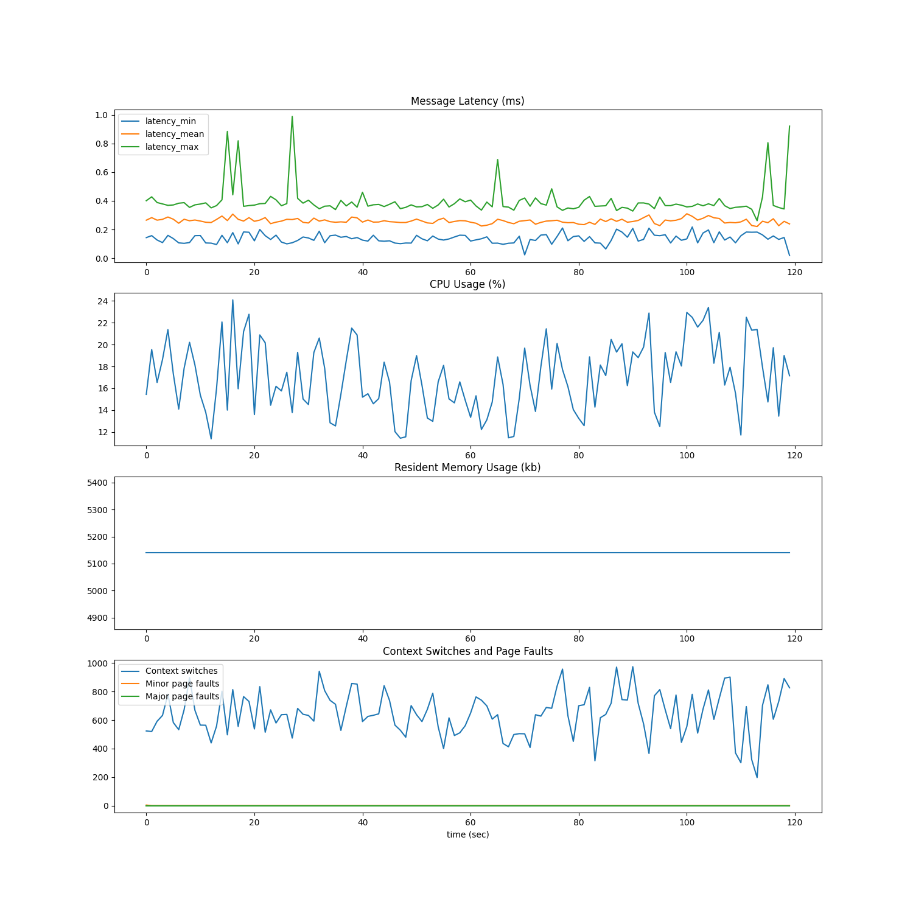

# PSF: Publish Subscribe Framework

PSF is a slim pub-sub framework. Main aim was a self-education. I decided to put my best and implement ROS-like framework from scratch. It took honest two months and I believe at least three iterations, where things were significantly refactored (mostly around capnp memory handling and threading model).

The main difference between ROS and PSF that PSF features synchronous data access ([waitset - see why](https://community.rti.com/best-practices/use-waitsets-except-when-you-need-extreme-latency)) opposite to asynchronous (callback-based) in ROS. i.e. application thread in PSF has full control, when access the data. This is archieved by providing a blocking call `waitData()`, which will unblock if any of subscribers received data. For data transport I rely on ASIO's UDP sockets, I also use ASIO event loop to handle asynchronous data processing.

Example node.
```c++
#include "msgs/PsfExamples.capnp.h"
#include "psf/Node.h"

using namespace psf;

int main()
{
	Node n("ping_server");
	auto sub = n.createSubscriber<Ping>("/ping");
	auto pub = n.createPublisher<Ping>("/pong");

	capnp::MallocMessageBuilder msgBuilder;
	auto pingMsg = msgBuilder.initRoot<Ping>();

	n.setSpinnerFunc([&]() {
		{
			n.waitData(); // block until data will be available
			pingMsg.setTimestampNs(sub->getMsgReader().getTimestampNs());
			pub->publish(pingMsg);
		}
	});
	n.spin(); // starts execution of spinner func in while loop

	return 0;
}
```

Example [Cap'n'Proto message](https://capnproto.org/language.html).
```
@0xa591a3348c08ac39;

struct Ping {
  timestampNs @0 :Int64;
}
```

## Quick start

Command below will build docker environment, compile and run ping example in tmux.
```
./run.sh
```

## Performance test

It will measure receiving latency and resource usage of subscriber. Publish rate is 1000HZ.

```
./run.sh --perf-test
```

Example results



## Concepts

Concepts are similar to ROS:
* Topic - a named bus for communication between nodes.
* Node - a container for topic publishers and/or subscribers that also runs (spins) user-defined application code.
* Publisher allows the application code to send (publish) a message on a topic (named bus).
* Subscriber allows the application to get notified on message reception and read the message if necessary.
* Message - a data entity that gets sent/received by nodes.
* Registry - central registry, where nodes register publishers and subscribers.

## Internals

### Threads

PSF node runs three threads by default:
1. Application thread (usually high-priority, cpu-pinned, etc.)
1. IO thread that sends and receives data to/from UDP sockets. Internally just runs ASIO event loop (`ioContext->run()`)
1. Registry client thread. Once a second fetches endpoints for publishers.

PSF uses UDP sockets to exchange the data between nodes.

PSF uses Cap'n'Proto data intercharge format. Currently :Text, :List and nested structs are not supported.

PSF registry server and client are Cap'n'Proto RPC-based.

## TODOs

* more tests
* parameters
* client tools
* time limited waitData()
* migrate from ASIO to `experimental/net`

## Credits

* [ASIO](https://think-async.com/Asio/) library
* [Cap’n'Proto](https://capnproto.org/)
* [Apex.ai performance_test](https://gitlab.com/ApexAI/performance_test)
